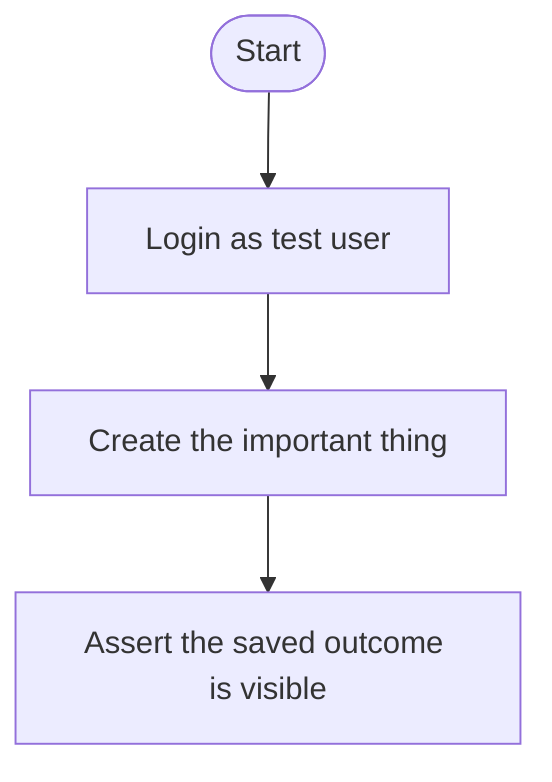

# Project Tests As Code
> Source: `buildprint guidelines get testing/project-tests` · Captured: 2026-07-17 (verbatim)

Buildprint project tests live in the CLI workspace under `tests/`. Edit these files when the user wants repeatable saved coverage, reusable test flows, or test folders. Test runs, run history, artifacts, and test-user credential records remain remote Buildprint data.

Project tests are app-global, not Bubble-branch-specific. Each branch workspace receives the current app-global `tests/` snapshot during `buildprint init`, `buildprint project clone`, and `buildprint sync`; another branch workspace becomes current after its next sync.

## Use the right surface

- Use `tests/` files for saved test definitions, reusable components, folders, assigned test users, viewport, timeout, and step graph wiring.
- Use `buildprint test-user list|get|create|update|delete` for saved test-user records. Do not hand-author credentials in test files.
- Use browser automation for ad hoc manual verification before saving a test or when debugging a failing step.
- Use the normal app worktree for Bubble structure, workflow logic, and reasoning about the behavior the test should cover.
- Use remote Buildprint surfaces for run history, run artifacts, and saved execution results.

## First-suite builder workflow

When a project has no useful saved tests yet, do not start by inventing JSON files. Build a small, reviewed suite from the actual app behavior:

1. Run `buildprint sync` so the worktree and `tests/` snapshot are current.
2. Explore the test version of the app with browser automation. Use the Bubble test-version URL or the branch URL the user wants covered.
3. Identify the product purpose, main roles, high-value pages, critical workflows, risky integrations, and any auth/setup requirements.
4. Ask the user which flows actually matter most. Keep this short and concrete; confirm the flows worth saving before writing files.
5. Propose a small test suite for review. Include runnable tests and reusable components where repeated setup exists.
6. For each proposed test, show the flow as Mermaid so the user can spot missing steps or wrong assumptions.
7. Let the user request changes or approve the suite.
8. Implement approved tests with `buildprint new test`, `buildprint new test-step`, and direct JSON edits only where needed.
9. Run `buildprint check` and fix every project-test issue.
10. Run `buildprint apply` after approval, then tell the user they can view the tests in Buildprint.

Useful proposal format:



Keep first suites small. Prefer three to six meaningful flows over broad, brittle coverage. Good first candidates are signup/login, primary create/update flows, billing or checkout, permission boundaries, import/export, and the highest-value dashboard or reporting path.

## File layout

A project test workspace uses one JSON file per test definition and one optional folder config per real folder:

```text
tests/<folder-key>/config.json
tests/<folder-key>/<test-key>.json
tests/__ungrouped__/<test-key>.json
```

- `tests/__ungrouped__/` is reserved for definitions without a folder and must not contain `config.json`.
- Stable keys use lowercase letters, numbers, and underscores. They are immutable identity. Rename `name` for display-only changes; changing `key` creates a new definition and archives the old key on apply.
- Folder config `key` must match the folder path segment. Definition `key` must match the JSON filename.
- Delete a definition file to archive that saved test on `buildprint apply`. Delete a folder config to archive that folder after its definitions are moved or removed.

Prefer scaffolding over hand-authoring from scratch:

```bash
buildprint new test --name "Checkout" --folder smoke
buildprint new test --component --name "Login"
buildprint new test-step --path tests/smoke/checkout.json --type test --instruction "Open checkout"
buildprint new test-step --path tests/smoke/checkout.json --type component --component login
```

## Definition syntax

Test and component files share the same top-level shape:

```json
{
  "schemaVersion": 1,
  "key": "checkout_smoke",
  "kind": "test",
  "name": "Checkout smoke",
  "description": null,
  "viewportPreset": "desktop",
  "liveTestUserId": null,
  "testVersionTestUserId": "t17...",
  "timeoutMinutes": 30,
  "graphStartX": 0,
  "graphStartY": 0,
  "steps": []
}
```

- `kind` is `test` for runnable tests or `component` for reusable flows.
- Components are not runnable by themselves and normalize `viewportPreset`, test-user ids, and timeout to `null`.
- `viewportPreset` is `desktop`, `laptop`, `tablet`, `mobile`, or `null` for the default.
- `timeoutMinutes` is an integer from 1 through 1440, or `null` for the default.
- `attachments` may preserve existing Buildprint storage references. Uploading new local attachment files from the CLI is outside this slice.

Step entries are graph nodes. Every step has a unique `graphNodeKey`, a `parentGraphNodeKey`, coordinates, and `onFailure` set to `stop` or `continue`.

```json
{
  "stepType": "test",
  "graphNodeKey": "open_checkout",
  "parentGraphNodeKey": "start",
  "parentConditionOutcome": null,
  "layoutX": 0,
  "layoutY": 160,
  "instruction": "Open the checkout page.",
  "details": null,
  "tips": "Wait for the cart total before continuing.",
  "onFailure": "stop"
}
```

Step types:

- `test`: an executable instruction for the runner.
- `condition`: an executable branch point. Children of a condition must use `parentConditionOutcome: "met"` or `"not_met"`; each outcome can have only one child.
- `component`: invokes a reusable component by `componentKey`, never by internal id. Component definitions cannot contain component steps.

## Validation and apply

Run `buildprint check` before applying. It validates project tests along with the rest of the workspace.

`buildprint check` verifies:

- valid JSON and canonical formatting
- schema version, enum values, timeout range, and required fields
- folder config and definition key/path matches
- duplicate folder keys, test keys, and step graph keys
- missing folders and missing component references
- component steps reference definitions whose `kind` is `component`
- no nested components inside component definitions
- reachable graph nodes, valid parents, no self-parenting, no cycles, and valid condition outcomes

`buildprint apply` sends only changed test/group operations for `tests/`. If only tests changed, the CLI skips the Bubble write request and only applies test-code changes. A stale base snapshot is rejected; run `buildprint sync`, resolve conflicts, run `buildprint check`, and retry.

## Test users

Saved test users are remote credentials, not workspace files. Use the CLI to manage them:

```bash
buildprint test-user list
buildprint test-user get <id>
buildprint test-user create --name "Smoke User" --database test --email user@example.com
buildprint test-user update <id> --email user@example.com --password-stdin
buildprint test-user delete <id>
```

- Use `testVersionTestUserId` for Bubble test-version runs and `liveTestUserId` for live-version runs.
- Match the user database to the target environment: most branch workspaces run against the Test database; the Bubble `live` branch uses the Live database.
- Do not put raw passwords in test JSON, shell history, or final user-facing notes. Prefer `--password-stdin` when setting a password.
- If a saved user has no password and the test is being rehearsed locally, use `buildprint login <email>` to install app-user cookies into Agent Browser instead of guessing credentials.
- When using a named Agent Browser session, pass the same `--session <name>` to `buildprint login` and subsequent browser commands.

## Stateless execution

Each project test run is stateless. It starts with no context other than the configured app URL, viewport, and assigned test user. Do not rely on another test having run first, an existing browser session, previous cookies, local storage, or data left by a prior run.

For tests that need an authenticated user, choose one explicit setup strategy:

- Start with a visible login flow, normally by invoking a reusable `login` component.
- For local browser rehearsal, run `buildprint login <email>` before `agent-browser open` and make the test instructions clear that the flow assumes a pre-authenticated test user.
- For tests whose purpose is login, signup, logout, SSO, password reset, or auth error handling, do not pre-authenticate. Drive the visible UI from a clean state.

## Reusable components

Use `kind: "component"` for repeated setup or navigation flows such as login, create account, open dashboard, seed a common record through the UI, or reach a shared app section.

Good component rules:

- Keep components short and purpose-specific.
- Name components by the reusable behavior, such as `Login as assigned user`, not by one test that happens to use them.
- Components should leave the app in a predictable state for the next step.
- Components cannot call other components, so flatten shared flows instead of nesting them.
- Refer to components with `componentKey`, not display name or internal id.

## What makes a good project test

- Prove a user-visible outcome, not only that a button can be clicked.
- Keep each test small enough that a failure points to one product behavior.
- Make setup explicit and stateless. Create or locate required data inside the test instead of relying on leftovers.
- Prefer stable visible labels, accessible names, and durable page states in instructions. Avoid fragile coordinates and timing-only waits.
- Include a final assertion step that checks the outcome the user cares about.
- Use `tips` for runner guidance that should persist, such as reliable selectors, expected waits, known loading states, or cleanup notes.
- Avoid tests that mutate live data unless the user explicitly wants live coverage and the test user/data are safe for live.
- If the test depends on app structure, inspect with `buildprint tree` and `buildprint context` first so the saved steps match the actual Bubble app.

## Practical rules

- Manual browser verification is not the same thing as maintaining a saved Buildprint test.
- If a user wants a one-off check, verify manually first.
- If they want repeatable coverage, update the saved test configuration after the flow is understood.
- Keep environment choice explicit: live vs test credentials, live vs test branch targets, and any branch-specific assumptions.
- Save screenshots, videos, downloaded files, and other user-visible artifacts under `/output` so they can be attached to the test run or conversation.

## Authentication during tests

- If a saved test has an assigned test user and the steps assume the user is already inside the app, run `buildprint login <email>` before the first `agent-browser open`.
- If the assigned test user's `.context/browser-auth.json` entry has `password: null`, start authenticated with `buildprint login`; do not invent a password or try the visible email/password form.
- From a branch workspace, `buildprint login <email>` infers the app and branch. Outside a workspace, use `buildprint login <email> --app <appId> --branch <branch>`.
- If you use an Agent Browser named session for the run, add `--session <name>` to `buildprint login` and to subsequent `agent-browser` commands.
- Do not pre-authenticate tests that verify login, signup, logout, SSO, password reset, or other visible auth behavior. For those, use the saved credentials from `.context/browser-auth.json` and drive the UI.
- Run-mode HTTP basic auth is separate from app-user login. `agent-browser open` automatically applies scoped auth for configured app origins; do not use `agent-browser set credentials` for Buildprint run-mode auth because it applies globally to third-party assets.

## Pairing tests with the worktree

- Use the worktree to inspect the relevant page, reusable, workflow, or backend surface before defining or debugging a test.
- Use `buildprint tree`, `buildprint summary`, and direct file reads to map a failing step back to the app structure.
- When a test failure mentions an internal ID or opaque workflow reference, resolve it in the worktree before explaining it to the user.
